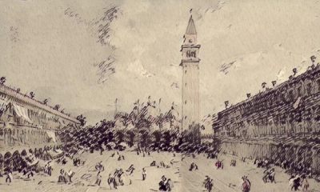

# MarcoPolo

Ficción interactiva sobre el retorno del explorador italiano a su casa, Venecia.

*Marco Polo vuelve de su viaje a oriente con un encargo del gran Khan. Desgraciadamente, el recibimiento no será tan grato como esperaba...*

Hay dos versiones de este relato interactivo: la primera, de 2007, fue escrita en Inform 6, mientras que la versión actual está escrita mediante <a href="http://github.com/baltasarq/fi.js">fi.js</a>.

<a href="http://baltasarq.github.io/MarcoPolo">Jugar</a>.
